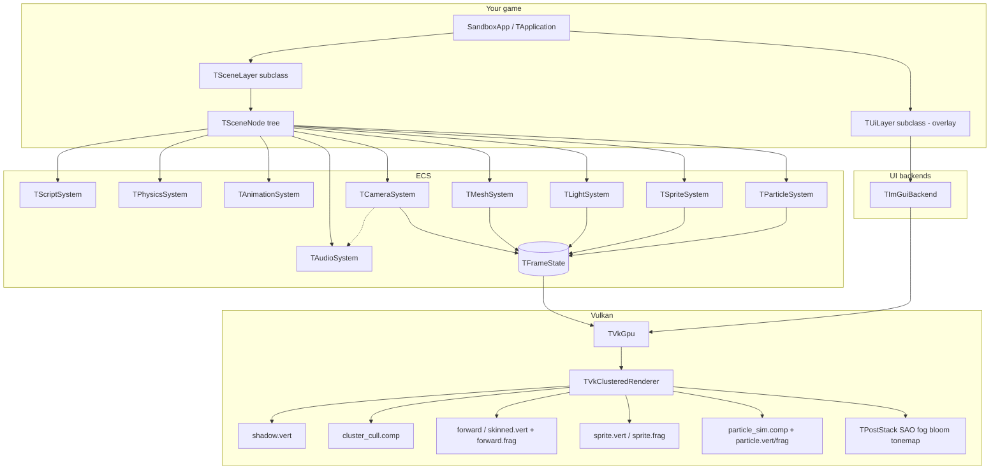
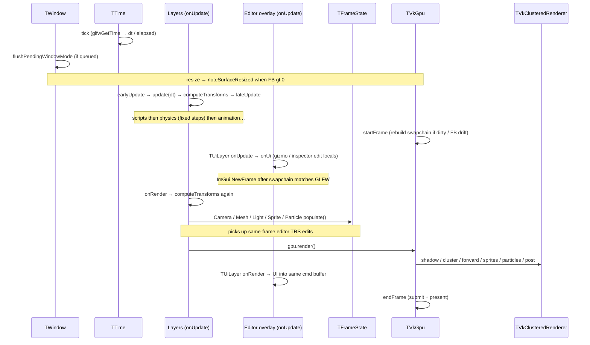

# Developing with Tomos

This guide explains how Tomos is put together and how to extend it — new scenes,
components, materials, shaders, lights, and overlays.

The working reference is [Sandbox/main.cc](../Sandbox/main.cc). Copy that pattern
for a new game; treat the engine library as the reusable core.

---

## Mental model

Tomos is **not** a black-box “engine that draws things.” It is three layers:


| Layer                          | Owns                                               | You usually…                                         |
| ------------------------------ | -------------------------------------------------- | ---------------------------------------------------- |
| **Game** (`Sandbox`, your app) | Scenes, scripts, lights, camera, assets            | Subclass `TSceneLayer`, spawn nodes                  |
| **ECS / systems**              | Components + per-frame population of `TFrameState` | Add components/systems                               |
| **Vulkan backend**             | Device, swapchain, `TVkClusteredRenderer`          | Change shaders / pipelines when you need new visuals |


Data always flows **one way** each frame:

```
Game logic (scripts, transforms) + editor overlay onUpdate
        ↓
TVkGpu::startFrame             (upload previous TFrameState → GPU buffers)
        ↓
TSceneLayer::onRender          (populate TFrameState, then gpu->render)
        ↓
TVkClusteredRenderer::render   (shadow → cluster cull → forward+sprites → particle sim+draw → HDR)
        ↓
TPostStack                     (SAO / fog / bloom → tonemap → swapchain or editor scene color)
        ↓
UI overlays (TUiLayer: ImGui into the same command buffer)
        ↓
TVkGpu::endFrame               (present)
```

If you remember only one rule: **the renderer only sees `TFrameState`.**  
Systems fill that struct in `onRender` (after `startFrame` uploads last frame’s
copy). Draw-call lists use the fresh CPU state; GPU buffers lag by one frame.

---


## Memory lifetimes

Tomos buckets CPU memory by lifetime. Do not mix buckets — a level pointer into
frame memory is a use-after-rewind bug.


| Bucket        | Owner                             | Free strategy                      | Typical contents                                    |
| ------------- | --------------------------------- | ---------------------------------- | --------------------------------------------------- |
| **Permanent** | App / heap                        | Explicit free / shutdown           | `TApplication`, GPU device, asset registry          |
| **Level**     | `TScene::store()` (`TLevelStore`) | `clear()` on scene switch / unload | Scene nodes (pooled handles), components            |
| **Frame**     | `TApplication::frameAllocator()`  | Rewind at end of each `run()` tick | Physics/mesh/sprite scratch, DFS stacks, blend sort |


### Frame arena contract

1. `TApplication::run` calls `m_frameAllocator.beginFrame()` at the start of each
  tick and `endFrame()` after present / window update — the **single rewind point**.
2. Pointers from `TFrameAllocator::arena()` are valid only until that rewind.
3. Prefer `TArenaVector<T>` / `TArenaAllocator` for per-tick STL scratch, or sticky
  member containers that `clear()` and retain capacity (physics hash maps).
4. In `TOMOS_DEBUG`, `TOMOS_HEAP_PROBE("label")` records mallinfo deltas into frame
  stats. `[FrameMem]` logs only when heap probes grow by more than 64 KiB in a
  frame; routine arena use is in the Performance panel.
5. Code that only runs inside the tick (ECS `populate`, physics, render recording)
  uses `TFrameAllocator::get()` and may assert without an application. Scene-graph
  queries (`findById`, `findByName`, `computeTransforms`) use `current()` with a heap
  fallback so tooling and tests can call them outside a frame.


### Level store / scene nodes

- Create nodes with `scene.createNode("Name")` — never `make_shared<TSceneNode>`.
- Tree edges and component lists are raw pointers owned by the level store.
- Prefer `emplaceComponent<T>(...)`; heap factories use `addComponent(unique_ptr)`.
- `TSceneManager` still holds `shared_ptr<TScene>` for the scene root object itself;
children live in the scene’s `TLevelStore`.
- Pooled nodes have **stable addresses** until destroyed; a `TNodeHandle` detects a
  destroyed node (`store.getNode(handle) == nullptr`).
- `removeChild` only detaches — the node stays alive in the store. To free a node
  and its subtree use `scene.store().destroyNode(node.handle())` (the hierarchy
  panel does this). `clearChildren()` destroys all pooled children.
- Removed components return their slot to a per-size freelist, so add/remove churn
  does not grow the level arena.
- `TLevelStore::topologyVersion()` bumps on node create/destroy and on
  `addChild`/`removeChild`. Anything that caches `TSceneNode*` (animator joint
  cache, skinned joints) rebuilds or re-validates against it — never keep a raw
  node pointer across frames without doing the same.
- On `switchPoint` / shutdown `TScene::clearLevel()` deactivates, destroys every
  node and component and resets the store in bulk.

Async glTF upload builds nodes into the active scene's store on the main thread
during `TAssetLoadQueue::tick(scene)` — workers never touch the frame or level
arenas. Claim the built hierarchy with `takeRoot(handle, scene)`; it returns null if
the scene was switched in between.

GPU resources stay on their own rules (upload ring, particle freelist, soft caps in
`TRenderLimits.hh`) — not CPU arenas.

---


## Architecture graph




> Physics never writes `TFrameState` — it only updates node transforms (fixed timestep).


## One frame, step by step

Exact order inside `TApplication::run` (frame `dt` comes from `TTime`,
wrapping `glfwGetTime`; use `TApplication::get().time()` for `dt` / `elapsed` /
`fixedDt` / pause):




Window mode is **deferred**: `setWindowMode` only queues; apply runs at the start
of the next frame (`Windowed` / `Borderless` / `Exclusive`). Apply does **not**
call `glfwPollEvents` or synthesize resize events. `TWindowResizeEvent` from the
normal poll, or a successful flush with a valid FB, call `TVkGpu::noteSurfaceResized()`.
On `startFrame`, if the dirty flag is set **or** the GLFW framebuffer size no longer
matches `m_extent`, the swapchain rebuilds (never at 0×0; prefers GLFW size when
surface caps are stale). Present/`acquire` `OUT_OF_DATE` / `SUBOPTIMAL` still
rebuild as a fallback.

**Present policy** (`fifo` / `mailbox` / `immediate` in config) selects
`VkPresentModeKHR` with fallbacks. Orthogonal to window mode.
`TRenderDestination` is where the post stack tonemaps for the primary view — swapchain
by default, or a custom offscreen image (`m_sampleAfterTonemap` for ImGui sampling).
`tonemapTargetsSwapchain()` drives UI compositing (LOAD vs CLEAR on the swapchain).

Overlay `onUpdate` (ImGui) runs **after** `startFrame` so `DisplaySize` matches
the rebuilt swapchain.

### What each stage reads/writes


| Stage                            | Input                                                                     | Output                                              |
| -------------------------------- | ------------------------------------------------------------------------- | --------------------------------------------------- |
| Scripts                          | Input, `dt`                                                               | Forces / impulses on rigid bodies, node locals      |
| Physics (fixed `1/60`)           | Forces, colliders                                                         | Body positions → `TTransform` translation           |
| Animation                        | `dt`, clips                                                               | Joint locals                                        |
| `computeTransforms`              | Dirty nodes                                                               | Cached global matrices                              |
| Mesh lateUpdate                  | Skinned joints                                                            | `m_boneMatrices`                                    |
| Editor UI (overlay)              | Mouse / ImGui                                                             | Node locals (gizmo / inspector)                     |
| `computeTransforms` (pre-render) | Dirty from UI                                                             | Cached globals again                                |
| `TCameraSystem::populate`        | Active camera node                                                        | View / proj / near / far                            |
| `TMeshSystem::populate`          | `TMeshComponent`s                                                         | `m_instances`, `m_drawCalls`, `m_bones`             |
| `TLightSystem::populate`         | `TLightComponent`s                                                        | `m_lights` (+ shadow slot / light VP)               |
| `TSpriteSystem::populate`        | `TSpriteComponent`s                                                       | `m_sprites`, `m_spriteBatches` (grouped by texture) |
| `TParticleSystem::populate`      | `TParticleEmitterComponent`s                                              | `m_emitters`, `m_particleDt`, `m_particleTextures`  |
| `startFrame`                     | `TFrameState`                                                             | GPU UBO / SSBOs                                     |
| Shadow pass                      | Lights with `m_shadowMap ≥ 0` (point: 6 faces), draws with `m_castShadow` | Depth array layers                                  |
| Cluster cull                     | Lights + view frustum params                                              | Per-cluster light lists                             |
| Forward pass                     | Draws + materials + cluster lists + shadows                               | HDR color + depth                                   |
| Post stack                       | HDR + depth                                                               | Tonemapped LDR (swapchain or editor scene color)    |


Source of truth for the shared CPU↔GPU types:

- [TomosEngine/src/Tomos/gpu/vulkan/TVkPass.hh](../TomosEngine/src/Tomos/gpu/vulkan/TVkPass.hh)


### Two ways data reaches the GPU


| Path                   | Used by                                                                                  | Cost                                                     |
| ---------------------- | ---------------------------------------------------------------------------------------- | -------------------------------------------------------- |
| Host-mapped `memcpy`   | Per-frame UBO / SSBOs in `uploadFrameState` (instances, lights, sprites, bones)          | A `memcpy` into already-mapped memory; no command buffer |
| Transfer command batch | `uploadBuffer` / `uploadImage` / `updateImage` — asset loads and animated-texture frames | A `vkCmdCopy*` recorded into the upload ring             |


The **upload ring** is three `TVkUploadSlot`s (one per frame in flight), each
with its own command buffer, fence and list of staging buffers.
`beginUploadBatch` claims the current slot, waiting on its fence only if that
slot is still in flight; `endUploadBatch` submits to the graphics queue and
returns immediately, then advances to the next slot. Staging buffers live on the
slot until its fence signals, and `startFrame` polls the fences to release them
early.

Nothing waits for a transfer before rendering because the uploads and the frame's
draws go to the same queue: the layout/access barriers recorded in the upload
command buffer also apply to work submitted after it. If you ever submit uploads
on a dedicated transfer queue, that guarantee disappears and you will need a
semaphore. `VkUtil::immediateSubmit` remains the synchronous escape hatch for
one-off work outside the frame loop.

### Transforms — locals, cached globals, `worldMatrix()`

Authoring edits **local TRS**. World pose is available two ways:


| API                  | Cost             | Freshness                 | Use when                                                                |
| -------------------- | ---------------- | ------------------------- | ----------------------------------------------------------------------- |
| `node.worldMatrix()` | O(depth)         | Always current            | Physics (before `computeTransforms`), editor overlays / gizmo / picking |
| `getGlobalMatrix()`  | O(1) after cache | After `computeTransforms` | Mesh / light / camera / sprite / particle populate                      |


Cached globals exist so `populate` can cheaply read hundreds of world matrices.
Physics and the editor run *between* transform passes, so they use
`worldMatrix()`.

`getLocalMatrix()` may rebuild locals without clearing the **global** dirty bit.
Only `updateGlobal` / `computeTransforms` clears it. A single shared dirty flag
used to be cleared by wireframe/physics reads, so the mesh kept a stale
(often unscaled) `getGlobalMatrix()` until the next authoring edit.

**Rule:** after `computeTransforms` in the render path → globals; anywhere else →
`worldMatrix()`.

### Physics vs inspector / gizmo

Order: **physics → editor UI → render populate**.


| Edit                 | Dynamic body (playing)                                                    | Static / no body              | Paused |
| -------------------- | ------------------------------------------------------------------------- | ----------------------------- | ------ |
| **Position**         | Inspector/gizmo `teleportTo` + zero velocity (re-asserted while dragging) | Local write; physics reads it | Free   |
| **Rotation / scale** | Physics is translation-only; collider size is `local × scale`             | Free                          | Free   |


Static floors re-read pose each step via `worldMatrix()`, so scale/move sliders
affect contacts on the next sim step.

---


## How to start a game

Minimal skeleton (same shape as Sandbox):

```cpp
class MyLayer : public TSceneLayer {
public:
    MyLayer() : TSceneLayer("MyGame") {}

    void onAttach() override {
        // Registers script / physics / animation / camera / mesh / light / sprite / particle / audio systems.
        TSceneLayer::onAttach();

        auto* gpu = TApplication::get().gpu();  // already TVkGpu*
        auto result = TGltfLoader::load("assets/level.glb", *gpu, scene().store());
        TApplication::get().assetSystem().registerAsset(std::move(result.m_asset));
        if ( result.m_root ) scene().addChild( result.m_root );

        // spawn camera, lights, scripts…
    }
};

class MyApp : public TApplication {
public:
    MyApp() : TApplication(TWindowProps{ "My Game", 1280, 720 }) {
        initGpu(
#if TOMOS_DEBUG
            true
#else
            false
#endif
        );
        pushLayer(std::make_unique<MyLayer>());
    }
};

int main() {
    MyApp app;
    app.run();
}
```

Build & run from the sandbox binary directory so relative paths (`assets/`,
`shaders/`) resolve. `TApplication` also calls `TPath::init` so loaders /
serializer resolve against the asset root (binary dir or `tomos.json` location)
even if cwd differs:

```bash
cmake --preset debug
cmake --build --preset debug -j
cd build/Sandbox && ./SandBox
```

### Compiler / C++26 reflection

Tomos targets **C++26** and uses **P2996 static reflection** (`<meta>`, annotations, expansion statements) for enum↔string helpers, POD component JSON/ImGui field codecs, and registry stubs under `Tomos/util/reflect/`.

| Toolchain | Status |
|-----------|--------|
| **GCC 16+** | Supported. CMake adds `-freflection` via `tomos_build_flags`. |
| **Upstream Clang** | Not supported yet for reflection. Prefer GCC 16+, or the experimental Bloomberg `clang-p2996` fork with `-freflection-latest`. |
| **MSVC** | No public C++26 reflection implementation. |

Host packages and Vulkan/`glslc` notes are in the root [README.md](../README.md).

---


## How to build scenes


### Nodes and components

- A **scene** is a root `TScene` (owned by `TSceneManager`; `TSceneLayer::scene()` accesses it).
- Everything else is a `TSceneNode` with a `TTransform` and zero or more components.
- `node.emplaceComponent<T>(...)` (or `node.addComponent(std::unique_ptr<T>)` for factory-made
  components) registers with the ECS when the scene is active.

Useful components today:


| Component                                  | System             | Purpose                                                  |
| ------------------------------------------ | ------------------ | -------------------------------------------------------- |
| `TCameraComponent`                         | `TCameraSystem`    | Active camera → view/proj                                |
| `TMeshComponent` / `TSkinnedMeshComponent` | `TMeshSystem`      | Mesh + material draw (+ bones)                           |
| `TAnimatorComponent`                       | `TAnimationSystem` | Plays / crossfades glTF clips (+ optional state machine) |
| `TLightComponent`                          | `TLightSystem`     | Point / directional / spot                               |
| `TSpriteComponent`                         | `TSpriteSystem`    | World-space billboard / sprite                           |
| `TParticleEmitterComponent`                | `TParticleSystem`  | GPU additive particle emitter                            |
| `TAudioComponent`                          | `TAudioSystem`     | 2D / spatial sound emitter                               |
| `TRigidBodyComponent`                      | `TPhysicsSystem`   | Dynamic body (fixed-step integrate)                      |
| `TColliderComponent`                       | `TPhysicsSystem`   | Sphere / OBB (static or with body; layer+mask filter)    |
| `TScriptComponent`                         | `TScriptSystem`    | Per-frame gameplay code (`update(dt)`)                   |


Hierarchy matters: a flashlight parented under the camera moves with it automatically (see Sandbox).

### Camera notes

- Perspective uses `m_fov` (vertical radians); orthographic uses
`TProjection::Orthographic` + `m_orthoHalfHeight`.
- After GLM `perspective` / `ortho`, Tomos flips `proj[1][1] *= -1` for Vulkan
NDC (Y down). Depth is **0 → 1** (`GLM_FORCE_DEPTH_ZERO_TO_ONE` in CMake).
Frustum extraction, SAO, and fog all assume that convention — do not drop
either without updating `TFrustum.hh` and the post shaders.
- Defaults are near `0.1` / far `1000`; Sandbox uses a tighter near (`0.05`).


### Loading a glTF / GLB

```cpp
auto result = TGltfLoader::load(path, *gpu, scene().store());
app.assetSystem().registerAsset(std::move(result.m_asset)); // keeps GPU resources alive
if ( result.m_root ) scene().addChild( result.m_root );      // places the hierarchy
```

The loader creates meshes, materials, textures (with a full **mip chain** generated on
upload), and a node tree with
`TMeshComponent`s (or `TSkinnedMeshComponent` when the mesh has bones).
Animation clips are stored on `TGpuAsset::m_clips`. It does **not** create
cameras or lights from the file — you add those in code.

Register the package with `TAssetSystem` (stable `m_name` / `m_id` / `m_sourcePath`).
Per-scene sprite/particle textures and audio clips go in `TScene::resources()`
(`TSceneResourceBag`), not the global asset registry.

Ownership contract lives in `systems/asset/TAssetHandles.hh`:

- Components **borrow** mesh/material/clip/image pointers; stores own them.
- Prefer stable refs (`TMeshAssetRef`, `TClipAssetRef`, `TBagTextureRef`) on
components so save/load and `rebind()` survive a store `generation()` bump.
- `gpu.missingTexture()` is a device sentinel — the bag never caches it as owned.
- Detach layers before `TAssetSystem::clear()` (already the app teardown order).


### Skeletal animation

Frame `dt` is passed from `TApplication` (`TTime`) → `TSceneLayer` →
`TECS::update(dt)` → `TAnimationSystem` / scripts.

```cpp
auto result = TGltfLoader::load("assets/CesiumMan.glb", *gpu, scene().store());
TGpuAsset* asset = result.m_asset.get();
app.assetSystem().registerAsset(std::move(result.m_asset));

TSceneNode& root = scene().createNode("Character");
auto& anim = root.emplaceComponent<TAnimatorComponent>();
anim.play(asset->m_clips.front().get());           // hard cut
anim.crossfadeTo(asset->findClip("Walk"), 0.35f);  // blend into Walk
if ( result.m_root ) root.addChild( result.m_root );
scene().addChild( &root );

// Optional Idle → Walk graph (scripts set bools before animation runs):
anim.m_stateMachine.addState("Idle", idleClip);
anim.m_stateMachine.addState("Walk", walkClip);
anim.m_stateMachine.addTransition("Idle", "Walk", "Moving", true, 0.35f);
anim.m_stateMachine.addTransition("Walk", "Idle", "Moving", false, 0.35f);
anim.m_stateMachine.start("Idle");
anim.applyState(*anim.m_stateMachine.findState("Idle"), 0.0f);
// later, from a script: anim.m_stateMachine.setBool("Moving", true);
```

`makeHoldPoseClip(src, "Idle")` builds a single-keyframe Idle from the first
sample of each channel when an asset only has one clip (Sandbox does this for
CesiumMan). Morph targets remain deferred.

Order each frame: scripts → **physics** → **animation** (state machine →
crossfade sample → joint locals) → `computeTransforms` → mesh `lateUpdate`
(bone = jointWorld × invBind) → populate bone SSBO → skinned forward / shadow
pipelines.

Caps: `k_maxBonesPerSkin` (128), `k_maxBonesPerFrame` (16384). APIs: `play` /
`crossfadeTo` / `stop` / `seek`, plus `m_speed` / `m_looping` /
`m_defaultFadeDuration` and `m_stateMachine` (Sandbox auto-toggles Idle↔Walk;
**G** forces a switch).

### Scripts (gameplay without forking the engine)

```cpp
class SpinScript : public TScript {
public:
    void update(float dt) override {
        node().m_transform.m_rotation =
            glm::angleAxis(dt, glm::vec3(0, 1, 0)) * node().m_transform.m_rotation;
        node().m_transform.setDirty();
    }
};

node.addComponent(TScriptComponent::make<SpinScript>());
```

Prefer scripts for camera controllers, spawners, door logic, etc. Prefer new **systems** when many entities need the same bulk behaviour.

### Physics (fixed timestep)

`TPhysicsSystem` uses a Gaffer-style accumulator: render/`dt` stays variable; only physics steps at `1/60` (max 8 substeps, frame clamp 0.25s). After stepping it writes an **interpolated** translation (`mix(previous, current, alpha)`) so motion stays smooth when the display rate ≠ 60. Order each frame: **scripts → physics → animation →** `computeTransforms`. Physics reads poses with `worldMatrix()` (see [Transforms](#transforms--locals-cached-globals-worldmatrix) above) because it runs before the cache is filled.

**Broadphase** rebuilds a uniform spatial hash each fixed step (`TPhysicsSystem::m_broadphaseCellSize`, default 2 world units). Candidate pairs share a cell, then AABB + narrowphase run as before.

**Layers / masks** (Godot / Bullet style) live on `TColliderComponent`:

- `m_layer` — bit flags for what this collider *is*
- `m_mask` — bit flags for what it collides *with*
- Pair is tested only when both agree: `(A.layer & B.mask) != 0 && (B.layer & A.mask) != 0`
- Defaults: `layer = TPhysicsLayer::g_default`, `mask = TPhysicsLayer::g_all` (everything still collides)
- Named bits in `TPhysicsLayers.hh`: `g_default`, `g_static`, `g_dynamic`, `g_player`, `g_trigger`, `g_projectile`, `g_all`

Scripts already receive the same variable app `dt` as the rest of the frame
(`TApplication` / `TTime` → `TSceneLayer` → `TScriptSystem`). Prefer that for
gameplay / camera motion. Physics advances with the bound `TTime::fixedDt()`
(default `TTime::k_defaultFixedDt` = 1/60) — `TSceneLayer` calls
`TPhysicsSystem::setTime(&app.time())` so physics does not include
`TApplication`. Do not drive dynamic bodies with variable `dt`. Change the step
with `time().setFixedDt(...)`.

```cpp
#include "Tomos/systems/physics/TPhysicsLayers.hh"

auto& body = node.emplaceComponent<TRigidBodyComponent>();
body.setMass(1.0f);

auto& col = node.emplaceComponent<TColliderComponent>();
col.m_shape = TColliderShape::Sphere; // or Box + m_halfExtents
col.m_radius = 0.5f;                  // local; × max|node scale|
col.m_layer = TPhysicsLayer::g_dynamic;
col.m_mask  = TPhysicsLayer::g_static | TPhysicsLayer::g_dynamic | TPhysicsLayer::g_trigger;

// Unit box (±0.5): leave halfExtents at 0.5 and size with Transform scale.
// col.m_halfExtents = { 0.5f, 0.5f, 0.5f };
// node.m_transform.setScale({ 4.0f, 0.3f, 4.0f });

// Forces from scripts (same frame, before physics update):
body.addForce({ 0, 10, 0 });
// Snap sim pose (don't write dynamic transform directly — it is interpolated):
body.teleportTo({ 0, 4, 0 });

// Trigger zone (no resolve; enter / stay / exit via callback):
auto& zoneCol = zone.emplaceComponent<TColliderComponent>();
zoneCol.m_shape = TColliderShape::Box;
zoneCol.m_isTrigger = true;
zoneCol.m_layer = TPhysicsLayer::g_trigger;
zoneCol.m_mask  = TPhysicsLayer::g_dynamic; // only sense dynamic bodies
zoneCol.m_onOverlap = [](TSceneNode& /*self*/, TSceneNode& other, TOverlapPhase phase) {
    if (phase == TOverlapPhase::Enter) { /* pickup / door / etc. */ (void)other; }
};
```

Translation only for dynamics (no angular / visual rolling yet); **dynamic vs static** and **dynamic–dynamic** contacts; **trigger** colliders report enter / stay / exit via `TColliderComponent::m_onOverlap` (and optional `TPhysicsSystem::setOverlapListener`). Box–box uses SAT (no sphere-shell approx). Collider sizes are **local × node scale** (so `0.5` hugs the unit box/sphere meshes). Zero local size is zero volume, not “auto-fit.” Box colliders honor node **rotation** (OBB). Contact bounce uses `m_restitution` only when inbound normal speed ≥ `TPhysicsSystem::k_restNormalSpeed` (0.5); slower contacts settle so gravity doesn’t leave a permanent micro-bounce. Best with root-level nodes. Sandbox spawns a lit **box floor**, two **UV-sphere balls** (dyn–dyn push), and a **trigger zone** (`PhysicsFloor` / `PhysicsBall` / `PhysicsBallB` / `PhysicsTriggerZone`) as a smoke test — floor `Static`, balls `Dynamic`, zone `Trigger` with mask `Dynamic`.

---


## How to add a new component + system

Use this when a feature is “many entities, same update rule” (physics body, AI, audio emitter…).

1. **Component** under `TomosEngine/src/Tomos/systems/<area>/`:

```cpp
class TFooComponent : public TComponent {
public:
    float m_strength = 1.0f;
};
```

2. **System** as `TTypedSystem<TFooComponent>`:

```cpp
class TFooSystem : public TTypedSystem<TFooComponent> {
public:
    void componentCreated(TSceneNode& node, TComponent& c) override { /* track */ }
    void componentDestroyed(TSceneNode& node, TComponent& c) override { /* untrack */ }
    void update( float p_dt ) override { /* per-frame; use p_dt for motion */ }

    // Only if the GPU needs it:
    void populate(TFrameState& state) const { /* push into state */ }
};
```

3. **Register** in `TSceneLayer::onAttach` (or in your layer after calling the base):

```cpp
scene().ecs().addSystem(std::make_unique<TFooSystem>());
```

4. If `populate` feeds the renderer, call it from your layer’s `onRender` **after**
  a `computeTransforms` (same place camera/mesh/light populate today in
   `TSceneLayer`) so same-frame editor edits are visible.
5. Attach on nodes: `node.emplaceComponent<TFooComponent>();`

---


## How to work with materials

Materials live in [TVkMaterial.hh](../TomosEngine/src/Tomos/gpu/vulkan/TVkMaterial.hh).

### What a material is today

- One **MaterialUBO** (base color, emission, metal, rough, normal scale, alpha cutoff, ignoreAlpha, hasNormalMap).
- Four **textures** on descriptor set 1 (`layouts().m_material`):
  - binding 1 base color  
  - binding 2 metallic-roughness  
  - binding 3 emission  
  - binding 4 normal
- A **mesh technique** (`TMeshTechniqueId`) — which shader/pipeline the material uses
(`Forward` by default, `Water` for stylized water). Pipelines live on
`TVkClusteredRenderer::m_meshTechniques`; the material stores only the id.

The forward shader samples **base + metallic-roughness**, **emission texture × emission factor**, and **normal maps** when `hasNormalMap` is set (TBN from mesh tangents). Meshes without Assimp tangents get a flat `(1,0,0,1)` fallback stream so pipelines can always bind tangents.

**Texture sentinels** on `TVkGpu`:

- `defaultTexture()` — 1×1 white for intentional “no map” slots (optional MR/emission/normal, untinted sprites).
- `missingTexture()` — black/magenta checkerboard when a referenced file fails to load (glTF textures, `TSceneResourceBag::loadImage`).


### Alpha


| glTF mode | Engine behaviour                                                                                                                                                                         |
| --------- | ---------------------------------------------------------------------------------------------------------------------------------------------------------------------------------------- |
| Opaque    | Drawn solid (`ignoreAlpha = 1`), depth write on                                                                                                                                          |
| Mask      | Discard below cutoff (`ignoreAlpha = 0`), depth write on                                                                                                                                 |
| Blend     | Sorted back-to-front, alpha-blended (`ignoreAlpha = 1` — skip discard; base.a drives framebuffer blend), depth test **without** write (no OIT — overlapping translucency is approximate) |


### Creating a material in code (no glTF)

```cpp
TVkMaterialDesc desc{};
desc.m_baseColorFactor = { 1, 0.2f, 0.1f, 1 };
desc.m_metallicFactor  = 0.0f;
desc.m_roughnessFactor = 0.6f;
desc.m_technique       = TMeshTechniqueId::Forward; // or Water
desc.m_baseTexture     = &gpu->defaultTexture(); // or your uploaded TVkImage
// …
auto mat = std::make_unique<TVkMaterial>(
    gpu->device(), gpu->physDevice(), gpu->descPool(),
    gpu->layouts().m_material, desc);
```

(`m_material` is the live 4-texture material layout. Keep materials / meshes /
textures owned by a `TGpuAsset` or your own long-lived store — draw calls only
store **pointers**.)

### Changing material parameters at runtime

Use the setters on `TVkMaterial` (`setBaseColorFactor`, `setMetallicFactor`,
`setRoughnessFactor`, `setEmissionFactor`, `setNormalScale`, `setAlphaCutoff`).
Each flushes the UBO via `push()`.

---


## How to add shader effects

Shaders live in:

`TomosEngine/src/Tomos/gpu/vulkan/shaders/`

CMake compiles them with `glslc` into `<build>/TomosEngine/shaders/*.spv` and
copies them next to the Sandbox binary. Release / RelWithDebInfo also pass
`glslc -O`. Fallback path macro: `TOMOS_SHADER_DIR` (used when not launched from
the binary directory).

### Current shader map


| File                                                                            | Stage    | Role                                                   |
| ------------------------------------------------------------------------------- | -------- | ------------------------------------------------------ |
| `shadow.vert`                                                                   | Vertex   | Depth-only shadow map (static)                         |
| `skinned_shadow.vert`                                                           | Vertex   | Depth-only shadow map (skinned)                        |
| `cluster_cull.comp`                                                             | Compute  | Assign lights to 16×9×24 clusters                      |
| `forward.vert`                                                                  | Vertex   | World pos / normal / UV / view depth                   |
| `skinned.vert`                                                                  | Vertex   | 4-influence GPU skinning → world pos/normal            |
| `forward.frag`                                                                  | Fragment | Cluster lookup + GGX + PCF shadows                     |
| `water.vert`                                                                    | Vertex   | Forward-like + light Y wave displace (`scene.time`)    |
| `water.frag`                                                                    | Fragment | Fresnel water tint + scrolled normals + cluster lights |
| `sprite.vert`                                                                   | Vertex   | Vertex-pulled billboard quads from the sprite SSBO     |
| `sprite.frag`                                                                   | Fragment | Unlit textured tint, alpha-blended                     |
| `particle_sim.comp`                                                             | Compute  | Update / emit / free-list GPU particle pool            |
| `particle.vert`                                                                 | Vertex   | Vertex-pulled spherical billboards from particle pool  |
| `particle.frag`                                                                 | Fragment | Soft disc × tint, additive blend                       |
| `fullscreen.vert`                                                               | Vertex   | Full-screen triangle for all post passes               |
| `sao_linearize.frag` / `sao_sample.frag` / `sao_blur.frag` / `sao_compose.frag` | Fragment | McGuire SAO (Alchemy AO + bilateral) → × HDR           |
| `fog.frag`                                                                      | Fragment | Exponential distance fog                               |
| `bloom_extract.frag` / `bloom_downsample.frag` / `bloom_upsample.frag` / `bloom_composite.frag` | Fragment | Threshold → Dual Kawase → add |
| `tonemap.frag`                                                                  | Fragment | Reinhard HDR → swapchain                               |


### Descriptor contracts (must stay in sync with C++)

**Forward graphics — set 0** (owned by `TVkClusteredRenderer`):


| Binding | Type                 | Contents                |
| ------- | -------------------- | ----------------------- |
| 0       | UBO                  | `TSceneUBO`             |
| 1       | SSBO                 | instances               |
| 2       | SSBO                 | lights                  |
| 3       | SSBO                 | light grid cells        |
| 4       | SSBO                 | light index list        |
| 5       | sampler2DArrayShadow | shadow maps             |
| 6       | SSBO                 | bone palette (`mat4[]`) |


**Forward graphics — set 1** (per material, `layouts().m_material`):


| Binding | Type                                  |
| ------- | ------------------------------------- |
| 0       | Material UBO                          |
| 1–4     | textures (base, MR, emission, normal) |


**Sprite graphics — set 0:**


| Binding | Type | Contents                  |
| ------- | ---- | ------------------------- |
| 0       | UBO  | `TSceneUBO` (view / proj) |
| 1       | SSBO | sprite instances          |


**Sprite graphics — set 1:** binding 0 = one `sampler2D` (batch texture).

**Cluster compute — set 0:** scene UBO, lights, grid, indices, atomic counter.

**Particle sim — set 0:** sim UBO, particle pool, free list, counters, flat draw
list, emitters, then the per-texture bucketing trio: `TParticleTexBuckets`
(binding 6), the compacted draw-index list (7) and one `VkDrawIndirectCommand`
per texture slot (8).

**Particle draw — set 0:** scene UBO, particle pool, compacted draw indices,
`TParticleTexBuckets` (the vertex shader adds `offsets[texIndex]` to
`gl_InstanceIndex`). Set 1 = the batch texture, same as sprites.

Layouts live in `TVkClusteredRenderer::createLayouts`.

If you change a layout in GLSL, update `TVkClusteredRenderer::createLayouts` / `createFrameResources` and the matching `struct` in `TVkPass.hh`.

### Recipe A — tweak the look (same pipeline)

1. Edit `forward.frag` (e.g. ambient, BRDF) or a post shader (`tonemap.frag`, `fog.frag`, …).
2. Rebuild (`TomosShaders` / the Sandbox target) and relaunch the app. SPIR-V is compiled at
  configure/build time via `glslc`; there is no runtime shader hot-reload.


### Recipe B — new material feature (extra uniform / texture)

1. Extend `TMaterialUBO` / `TVkMaterialDesc` / material constructor writes.
2. If you need a new sampler, extend `TVkLayouts::m_material` in `TVkGpu::createLayouts` and the material descriptor writes.
3. Mirror fields in `forward.frag`.
4. Optionally teach `TGltfLoader` to fill the new fields from Assimp.


### Recipe C — entirely new pass / technique (e.g. outline, decals)

1. Add GLSL under `shaders/`, list it in `TomosEngine/CMakeLists.txt` `GLSL_SOURCES`.
2. Create pipeline(s) in `TVkClusteredRenderer::createPipelines`.
3. Record commands in a new `recordXPass` and call it from `render()` in the right barrier order.
4. Leave the swapchain in `COLOR_ATTACHMENT_OPTIMAL` if later overlays still need to draw.

Do **not** put pass logic back into `TVkGpu` — keep `TVkGpu` as device/swapchain/frame plumbing.

### Recipe D — new mesh technique (material owns a shader)

Materials select a `TMeshTechniqueId`; the renderer owns a table of PSOs
(`m_meshTechniques`) sharing `m_forwardPipeLayout` + set-1 material bindings.
`drawMesh` does `m_meshTechniques[material->technique()].pick(blend, skinned)` —
no growing switch. Unsupported slots are `VK_NULL_HANDLE` and that draw is skipped.

1. Add a value to `TMeshTechniqueId` in [TMeshTechnique.hh](../TomosEngine/src/Tomos/gpu/vulkan/TMeshTechnique.hh).
2. Add GLSL under `shaders/`, list it in `GLSL_SOURCES`.
3. In `TVkClusteredRenderer::createGraphicsPipelines`, fill
  `m_meshTechniques[Id]` (opaque / blend / skinnedOpaque / skinnedBlend as needed).
4. Set `TVkMaterialDesc::m_technique` (and usually `m_alphaMode`) on the material.

`TSceneUBO::m_time` / `scene.time` is filled each frame from `TTime::elapsed()`
for animated techniques (e.g. Water).

---


## How to add / change lights and shadows


### Lights

`TLightComponent` fields drive `TLightSystem::populate` → `TLightData` → shaders.


| Type        | `m_type` in GPU | Shadow support                                                       |
| ----------- | --------------- | -------------------------------------------------------------------- |
| Point       | 0               | Yes — 6 consecutive array layers (cubemap faces), far = `m_maxRange` |
| Directional | 1               | Yes — frustum-fitted ortho VP, one array layer                       |
| Spot        | 2               | Yes — perspective VP from outer cone, one array layer                |


Limits (constants in `TRenderLimits.hh`, re-exported via `TVkPass.hh`): 128 lights, 16 shadow-map layers @ 2048²,
64 lights per cluster. Point casters consume **6 layers** each
(`k_pointShadowFaces` in `TPointShadow.hh`).

### To add a new light behaviour

1. Pack extra fields in `TLightData` (keep `alignas(16)` / std430 matching the GLSL `Light` struct).
2. Fill them in `TLightSystem::populate`.
3. Update `shadeLight` in `forward.frag` and the sphere/AABB test in `cluster_cull.comp`.


### Shadow knobs

- Ortho size for the sun: `kDirShadowHalfSize` / `kDirShadowDepth` in `TLightSystem.cc`.
- Point cubemap near plane: `k_pointShadowNear` in `TPointShadow.hh` (must match
`point_shadow.glsl`). Far plane is the light’s `m_maxRange`.
- Bias / slope: raster state in `TVkClusteredRenderer::createPipelines` (shadow
pipeline — constant 1.25, slope 1.75 today).
- Resolution / layer count: `k_shadowMapSize` / `k_maxShadowMaps`.

Meshes opt into casting via `TMeshComponent::m_castShadow` (default true).
Forward ambient is a small constant (`base.rgb * 0.03` in `forward.frag`).

### Debug views (cluster visualization)

Set `TFrameState::m_debugMode` (`TDebugView` in `TVkPass.hh`) — the Sandbox
debug Renderer panel has a combo for it:


| Mode           | Shows                                                                                               |
| -------------- | --------------------------------------------------------------------------------------------------- |
| `ClusterGrid`  | One hashed color per froxel — the actual cluster frustums (16×9 screen tiles × 24 log-depth slices) |
| `LightHeatmap` | Lights-per-cluster load, blue (0) → red (`k_maxLightsPerCluster`)                                   |
| `DepthSlices`  | Only the logarithmic Z subdivision                                                                  |


Rendered by `forward.frag` (blended 65 % over the lit HDR result), driven by the
`m_debug` field at the end of `TSceneUBO`.

Mesh **CPU frustum culling** is separate — see [Frustum culling](#frustum-culling).

---


## How to add post effects (SAO, bloom, fog, …)

The scene no longer writes the swapchain directly.  Flow:

```
shadows → cluster cull → forward+sprites → particle sim+draw → HDR + depth
        → TPostStack (SAO → fog → bloom → tonemap → swapchain)
        → UI overlays
```

Forward writes **HDR** `R16G16B16A16_SFLOAT` (ping-pong `m_hdrA` / `m_hdrB`) and
**depth** `D32_SFLOAT`. Tonemap is the only effect that writes the swapchain;
the image stays in `COLOR_ATTACHMENT_OPTIMAL` so UI overlays can `LOAD` over it.

Effects live under `gpu/vulkan/post/`:


| Class          | Default | Tunables                                                                              | Role                                              |
| -------------- | ------- | ------------------------------------------------------------------------------------- | ------------------------------------------------- |
| `TPostSAO`     | on      | `m_radius`, `m_bias`, `m_intensity`, `m_sampleCount`, `m_blurSharpness`, `m_temporalBlend` | Half-res McGuire SAO × HDR                    |
| `TPostFog`     | off     | `m_density`, `m_color`                                                                | Distance fog                                      |
| `TPostBloom`   | on      | `m_threshold`, `m_strength`, `m_iterations`                                           | Threshold → Dual Kawase pyramid → add             |
| `TPostTonemap` | always  | —                                                                                     | Reinhard HDR → swapchain (cannot disable)         |


SAO (Scalable Ambient Obscurance, McGuire HPG 2012 core variant) runs at **half
resolution**: linearize depth, AlchemyAO spiral (`m_sampleCount`, default 12)
with normals from depth gradients, one separable bilateral H+V, temporal history
ping-pong, then compose with linear upsample into full HDR. Radius is
**world-space meters** (Sandbox slider ~0.05–2). The z-MIP hierarchy from the
paper is not implemented yet. Finite far planes are used today; an infinite-far
`perspectiveVk` would improve Z reconstruction precision.

Toggle / tune from the Sandbox Renderer panel, or in code:

```cpp
auto* bloom = gpu->renderer()->postStack().find<TPostBloom>();
bloom->m_enabled = false;
```

**Adding a new effect:** implement `TPostEffect` (`onResize` / `record` / `destroy`),
`m_post.add(...)` in `TVkClusteredRenderer::initPostStack` **before** tonemap,
add GLSL to `GLSL_SOURCES`.  Read/write HDR via `ctx.m_hdr` / `ctx.m_hdrOther`
then `ctx.swapHdr()`.  Use **per-frame descriptor sets** (`ctx.m_frameIndex`,
`g_kFramesInFlight`) — never update a set already recorded into an in-flight
command buffer.

This is an ordered effect stack, not a full render graph yet (barriers are still
hand-written inside each effect).

---


## Frustum culling

`TMeshSystem::populate` extracts the camera frustum from `m_viewProj` and skips
meshes whose **world AABB** is fully outside.  Local AABBs are computed at glTF
load time (`TVkMesh::m_aabb`).  Debug UI shows `meshes total / frustum-culled`.

Shadow casters are *not* dropped entirely: a culled mesh with `m_castShadow`
stays in the draw list with `TDrawCall::m_visible = false`, so the forward pass
skips it but the shadow passes still render it (off-screen geometry must keep
casting shadows into the visible scene).

Skinned meshes still use the bind-pose AABB (imperfect if the pose exceeds it).
Plane extraction lives in `util/math/TFrustum.hh` and follows the Vulkan
0-to-1 depth convention.

---


## How to render world sprites / billboards

Sprites in the 3D scene are just another component — no renderer code needed:

```cpp
TSceneNode& node = scene().createNode("Marker");
node.m_transform.m_translation = { 0.0f, 3.0f, 0.0f };
node.m_transform.setDirty();

auto& sprite    = node.emplaceComponent<TSpriteComponent>(myTexture);  // TVkImage*, or nullptr = white
sprite.m_size   = { 0.5f, 0.5f };                 // world units
sprite.m_color  = { 1.0f, 0.8f, 0.2f, 0.9f };     // tint * alpha
sprite.m_mode   = TBillboardMode::Spherical;      // or Cylindrical / Fixed
sprite.m_uvMin  = { 0.0f, 0.0f };                 // atlas sub-rect
sprite.m_uvMax  = { 0.5f, 0.5f };
scene().addChild( &node );
```

Billboard modes:


| Mode          | Behaviour                       | Use for                         |
| ------------- | ------------------------------- | ------------------------------- |
| `Spherical`   | Always faces the camera         | Particles, glows, light gizmos  |
| `Cylindrical` | Rotates around world Y only     | Trees, characters, signs        |
| `Fixed`       | World XY plane, no billboarding | Decals-on-a-plane, flat markers |


Alpha modes (`TSpriteAlphaMode`, the sprite analogue of material `TMatAlpha`):

| Mode                 | Depth                                            | Draw order                                            | Use for                                   |
| -------------------- | ------------------------------------------------ | ----------------------------------------------------- | ----------------------------------------- |
| `Cutout` (default)   | Test + **write** for texels ≥ `m_alphaCutoff`    | With opaque meshes, before blend meshes               | GIF/video boards, gizmos, hard-edged icons |
| `Blend`              | Test only, no write                              | Back-to-front, after blend meshes, before particles   | Glows, fades, anything with tint alpha < 1 |

Cutout sprites behave like solid geometry for everything drawn later — glass /
water, blend sprites, particles — and for post (fog at their own depth, SAO). Only
texels above the cutoff write depth, so antialiased edges do not stamp a hard
silhouette. Blend sprites never write depth; particles (drawn later) always composite
on top of them.

How it flows through the frame:

1. `TSpriteSystem::populate` collects visible sprites into `TFrameState::m_sprites` /
  `m_spriteBatches`: cutout sprites first (sorted by texture only — depth handles order),
   then blend sprites **back-to-front** (ties by texture). Consecutive same-texture runs
   of the same mode become one batch / draw.
2. `TVkGpu::startFrame` uploads them into the per-frame sprite SSBO (`k_maxSprites = 10 000`).
3. `TVkClusteredRenderer::recordSprites` runs twice inside the forward pass: cutout
  batches right after the opaque/mask meshes, blend batches after the sorted blend
   meshes. `sprite.vert` expands each instance into a quad (vertex pulling — no vertex
   buffers); `sprite.frag` samples texture × tint and discards below the per-sprite cutoff.

Sprites are unlit and never cast shadows.

> Limitations (no OIT): blend meshes and blend sprites are two separately sorted
> groups (painter's order between them); overlapping translucent sprites are
> approximate; particles are additive and not depth-sorted against blend sprites.

For a texture, upload a `TVkImage` (same path as material textures) and keep it
alive — the component only borrows the pointer.

### Animated textures (GIF / WebP / video)

`TSceneResourceBag::resolveTexture` routes by extension:


| Extension                           | Path                                                     |
| ----------------------------------- | -------------------------------------------------------- |
| `.png` `.jpg` `.jpeg` `.bmp` `.tga` | Static via stb (`loadImage`)                             |
| `.gif` `.webp`                      | Cached frame decode (FFmpeg) → shared CPU cache          |
| `.mp4` `.webm` `.mov` `.mkv` `.avi` | Streaming video decode (one FFmpeg decoder per instance) |


Each animated assignment creates a `TAnimatedTexture` that owns a stable
`TVkImage` (mipLevels = 1). `TAnimatedTextureSystem` ticks all bag instances
each frame and re-uploads pixels via `TVkGpu::updateImage` — shaders and
descriptor sets stay unchanged. Those per-frame uploads go through the async
upload ring (below), so decoding a new video frame no longer stalls rendering.

```cpp
TBagAnimatedTextureRef opts{ "assets/textures/demo.gif" };
TVkImage* tex = scene().resources().resolveTexture( *gpu, opts.m_path, opts );

auto& sprite    = node.emplaceComponent<TSpriteComponent>( tex );
sprite.m_animRef = opts;

// Mesh base / emission override (clones material in TMeshSystem):
mesh->m_baseTextureOverride = TBagAnimatedTextureRef{ "assets/textures/screen.mp4" };
mesh->rebindOverrides( scene().resources(), *gpu );
```

Host package: FFmpeg (`libavformat` / `libavcodec` / `libavutil` / `libswscale`) —
see root [README.md](../README.md). Sandbox demos: `AnimGifSprite` + `VideoScreen`.

---


## How to spawn GPU particles

Particles are **GPU-simulated** additive billboards. The CPU only uploads
**emitters**; a compute pass owns a persistent pool (`k_maxParticles = 65536`).

```cpp
TSceneNode& node = scene().createNode("Sparks");
node.m_transform.m_translation = { 0.0f, 0.2f, 0.0f };
node.m_transform.setDirty();

auto& emitter           = node.emplaceComponent<TParticleEmitterComponent>();
emitter.m_emitting    = true;
emitter.m_rate        = 80.0f;                 // particles / second
emitter.m_lifetimeMin = 0.35f;
emitter.m_lifetimeMax = 0.9f;
emitter.m_velocityMin = { -0.8f, 1.5f, -0.8f };
emitter.m_velocityMax = { 0.8f, 4.0f, 0.8f };
emitter.m_sizeStart   = { 0.12f, 0.12f };
emitter.m_sizeEnd     = { 0.02f, 0.02f };
emitter.m_colorStart  = { 1.0f, 0.85f, 0.35f, 1.0f };
emitter.m_colorEnd    = { 1.0f, 0.15f, 0.02f, 0.0f };
emitter.m_gravity     = -3.5f;
emitter.m_texture     = mySoftSmoke;           // optional TVkImage* (nullptr = soft white disc)
emitter.m_uvMin       = { 0.0f, 0.0f };        // atlas sub-rect (same as sprites)
emitter.m_uvMax       = { 1.0f, 1.0f };
scene().addChild( &node );

// One-shot burst from a script or UI:
emitter.burst(200);
```

Frame path:

1. `TParticleSystem::populate` decides spawn counts (`rate * dt` + bursts) and
  writes `TFrameState::m_emitters` / `m_particleDt` / `m_particleTextures`.
2. `startFrame` → `TVkClusteredRenderer::uploadParticles` fills the emitter SSBO
  and sim UBO.
3. After sprites, `particle_sim.comp` runs five phases: update the pool (0),
  emit into free slots (1), prefix-sum the per-texture counts (2), scatter the
   flat draw list into one contiguous run per texture (3), and write one
   `VkDrawIndirectCommand` per texture slot (4). Phases 0 and 1 tally
   `TParticleTexBuckets::m_counts` as they append.
4. `particle.vert` / `particle.frag` draw textured soft spherical discs with
  **additive** blend (`SRC_ALPHA` / `ONE`) into HDR (bloom picks them up).
   Textures reuse the sprite descriptor cache (`spriteTextureSet`); one indirect
   draw per registered texture (up to `k_maxParticleTextures` = 64). Because the
   sim wrote each slot's `instanceCount`, a draw only touches its own particles —
   unused slots cost nothing and no shader-side texture check is needed.

Limits: `k_maxEmitters = 64`. Unlit, no shadows, no depth write. Keep textures
alive (same borrow rules as `TSpriteComponent`).

Sandbox: orange sparks at `SparkEmitter` near CesiumMan — tune emitter fields in the
Inspector; Renderer shows emitter counts.

---


## How to play sounds

Audio is an ECS feature (not part of `TFrameState`). Backend: **miniaudio**
(FetchContent), driven by `TAudioSystem`.

```cpp
// Keep the clip alive (layer member, asset bag, …).
auto clip = std::make_unique<TAudioClip>( "assets/beep.wav", "Beep" );

TSceneNode& node = scene().createNode( "Emitter" );
node.m_transform.m_translation = { 2.0f, 1.5f, 0.0f };
node.m_transform.setDirty();

auto& audio           = node.emplaceComponent<TAudioComponent>( clip.get() );
audio.m_spatial     = true;   // false = 2D / non-positional
audio.m_looping     = false;
audio.m_volume      = 1.0f;
audio.m_minDistance = 1.0f;
audio.m_maxDistance = 40.0f;
audio.m_playOnStart = false;  // or true to start when the component is registered
scene().addChild( &node );

// Later, from a script or UI:
audio.play();   // restart by default
audio.stop();
```

Behaviour:


| Piece             | Role                                                                   |
| ----------------- | ---------------------------------------------------------------------- |
| `TAudioClip`      | Path to a WAV / FLAC / MP3 / Ogg file (borrowed by emitters)           |
| `TAudioComponent` | Per-node emitter — volume, pitch, loop, spatial range, `play` / `stop` |
| `TAudioSystem`    | Owns the miniaudio engine; starts/stops voices in `lateUpdate`         |
| Listener          | Active camera pose, wired by `TSceneLayer` before `lateUpdate`         |


Spatial emitters use **linear attenuation** (miniaudio
`ma_attenuation_model_linear`): gain falls to zero at `m_maxDistance`, so sounds
go fully silent beyond that range. `m_minDistance` is the distance at which
attenuation begins (full volume inside). Non-spatial (`m_spatial = false`) voices
ignore distance and play at constant volume.

`TAudioSystem` also **culls voices by distance** for CPU savings: when the
listener is farther than `m_maxDistance`, the voice is destroyed but `m_playing`
stays true so looping sounds resume when you re-enter range. Re-creation uses
**hysteresis** at `m_maxDistance * 0.9` to avoid flicker at the boundary. Emitters
with `m_volume <= 0` skip voice creation entirely.

Master volume: `system<TAudioSystem>().setMasterVolume(0.5f)`.

Sandbox: green sprite near CesiumMan is the emitter — press **F** to beep, or
edit the Audio component in the Inspector. Walk toward / away to hear attenuation
and silence beyond `m_maxDistance`.

> Changing `m_spatial` while a voice is active requires `stop()` then `play()`
> so the system can recreate the voice with the right flags.

---


## How to build UI (ImGui now, HTML later)

UI lives in `src/Tomos/ui/` and is split into two pieces:

- `TUiLayer` — an overlay layer that owns a backend and drives it each frame
(`newFrame` → your UI code → `render` into the frame's command buffer).
In **game** frame output this is a color-only `LOAD` pass over the tonemapped
swapchain. In **editor** frame output the swapchain is cleared and only ImGui
draws (the 3D scene is shown inside a Scene panel via `ImGui::Image`).
- `TUiBackend` — the interface a UI technology implements.
  - `TImGuiBackend` — Dear ImGui docking branch (GLFW + Vulkan dynamic rendering).
  Fetched and built automatically by CMake. Use for debug tools / editors.
  `registerTexture` / `unregisterTexture` wrap `ImGui_ImplVulkan_AddTexture`.
  - A second backend (e.g. HTML/CSS) would implement the same interface; none ships today.


### Adding a debug/tooling overlay

Subclass `TUiLayer`, build widgets in `onUi()`, push as an **overlay**:

```cpp
#include <imgui.h>
#include "Tomos/ui/TImGuiBackend.hh"
#include "Tomos/ui/TUiLayer.hh"

class DebugUiLayer : public TUiLayer {
public:
    DebugUiLayer() : TUiLayer(std::make_unique<TImGuiBackend>(), "DebugUI") {}

    void onUi(float dt) override {
        ImGui::Begin("Stats");
        ImGui::Text("frame %.2f ms", dt * 1000.0f);
        ImGui::End();
    }
};

// in your TApplication subclass, after initGpu():
pushOverlay(std::make_unique<DebugUiLayer>());
```

Rules that keep this correct:

1. **Build UI only inside** `onUi()` (or later in the same frame). Overlays
  update after scene layers, and the ImGui frame starts right before `onUi` —
   calling `ImGui::…` from a scene layer's `onUpdate` hits a not-yet-begun frame.
2. **Push as overlay, not layer**, so it renders after the 3D scene and receives
  events first.
3. **Input capture is automatic**: when any ImGui window is focused / hovered /
  active (not only text fields), `TUiLayer::onEvent` marks all `INPUT` events
   handled so scene layers never see them. For polling, use `TInput` /
   `TInputPoll` with a block callback (e.g. `TImGuiBackend::ioBlocksGameInput()`)
   instead of raw `glfwGetKey`. While the cursor is `Disabled`, ImGui sets
   `ImGuiConfigFlags_NoMouse` so look-around does not hover UI. Tab releases
   the cursor for the editor (Sandbox fly cam).


### Scene editor (docked debug chrome)

`TSceneEditorLayer` is a full editor shell (ImGui docking + ImGuizmo). It lives in the
separate `TomosEditor` static library, built when `TOMOS_BUILD_EDITOR=ON` (CMake
default). Build without it: `cmake -B build -DTOMOS_BUILD_EDITOR=OFF`. Linking
`TomosEditor` defines the public `TOMOS_EDITOR` macro — gate app includes / overlays
with `#ifdef TOMOS_EDITOR`.

On attach it sets an offscreen `TRenderDestination` (renderer `m_sceneColor`): tonemap writes LDR
`m_sceneColor` sized to the Scene panel (`renderExtent`), the swapchain is cleared
to the editor background, and the Scene panel samples that texture.


| Piece                  | Role                                                                                                           |
| ---------------------- | -------------------------------------------------------------------------------------------------------------- |
| `TSceneEditorLayer`    | DockSpace host, menu (Save/Load, View, Play/Pause), texture sync                                               |
| `TSceneViewportPanel`  | `ImGui::Image` of scene color; ImGuizmo TRS; click-to-pick; overlays                                           |
| `TSceneHierarchyPanel` | Filterable tree; badges; deep duplicate (incl. registered scripts); drag-drop reparent                         |
| `TSceneInspectorPanel` | Name/dynamic/TRS + per-component editors + Add Component / Add Script                                          |
| `TAssetBrowserPanel`   | Filesystem + loaded GPU assets; drag-drop mesh/audio/texture onto nodes                                        |
| `TRendererDebugPanel`  | Debug views, scene counters, lights/draws tables, post FX, camera                                 |
| `TPerformancePanel`    | Debug-only CPU/GPU timings, frame memory, scene counts (View → Performance; Capture toggle)         |
| `TPhysicsDebugPanel`   | Gravity, step stats, body/collider lists, overlay toggles                                                      |
| `TConsolePanel`        | `TLogger` ring buffer (level filter / clear)                                                                   |
| `TDebugDraw`           | World AABB/line projection into the Scene panel rect                                                           |
| `TSceneSerializer`     | JSON save/load (`assets` preamble + `children` tree)                                                           |
| `TComponentRegistry`   | Factory + serialize for camera/light/mesh/skinnedMesh/animator/sprite/particleEmitter/audio/rigidBody/collider |
| `TScriptRegistry`      | Script factories by type name (`FlyCamera`, …) for serializer + inspector                                      |
| `TSceneResourceBag`    | Owned by `TScene` (`scene.resources()`): audio clips + loose textures                                          |


**Performance panel (Debug only):** compiled out when `TOMOS_DEBUG=0` (Release /
RelWithDebInfo). Instrumentation uses `TOMOS_PROFILE_SCOPE` /
`TOMOS_PROFILE_GPU_*` macros in `Tomos/util/profile/TProfile.hh` — no-ops in
Release. In Debug, capture defaults **off**; opening View → Performance (or
checking **Capture**) enables CPU scopes + lazy `VkQueryPool` timestamps. Closing
the panel or unchecking Capture turns measurement off again. FPS header uses
`realDt` with EMA smoothing; **Freeze** holds the last snapshot. GPU pass times
are from the prior completed submission (query readback after the in-flight
fence). Frame-arena stats replace the old periodic `[FrameMem]` console spam
(console still logs heap probes over 64 KiB).

**Present / render extent:** `TVkGpu::renderExtent()` drives HDR/depth/post and
camera aspect. Swapchain extent stays at the window size. Without the editor
overlay, tonemap targets the swapchain via `TRenderDestination` (default).
Config `presentMode` (`fifo` / `mailbox` / `immediate`) controls `VkPresentModeKHR`.
Config `windowMode` (`windowed` / `borderless` / `exclusive`) controls the OS window.

**Play / Pause:** menu bar Play/Pause button (Space is unbound — fly-cam uses
it for move-up). Toggles `TScene::setSimulationPlaying` /
`isSimulationPlaying` — when paused, `TSceneLayer` skips script/physics/animation
updates but still recomputes transforms and populates `TFrameState` so
gizmo/inspector edits remain visible. (`TTime::setPaused` exists and zeros
`dt`, but the editor does not call it.)

**Gizmos / picking:** Translate/Rotate/Scale (toolbar or Q/W → Translate, E →
Rotate, R → Scale). Left-click in
the Scene image (when not over a gizmo) raycasts mesh/collider AABBs via
`m_viewProjInv`. Physics collider/velocity overlays draw in the panel.
ImGuizmo gets a copy of `m_proj` with the Vulkan Y flip undone (OpenGL NDC);
rendering and picking keep Vulkan Y-down.

**Scene JSON** stores assets, the node tree, and components — including
`{ "type": "script", "script": "<name>" }` for types registered in
`TScriptRegistry`.

Wire-up (Sandbox pattern):

```cpp
TScriptRegistry::get().registerType<FlyCameraScript>("FlyCamera");

auto layer = std::make_unique<MySceneLayer>();
auto* ptr  = layer.get();
pushLayer(std::move(layer));

auto editor = std::make_unique<TSceneEditorLayer>(ptr->scene()); // bag is scene.resources()
// Optional: only for app-specific glue (globals, blend setup). Scripts restore from JSON.
editor->context().m_afterLoad = [ptr] { ptr->bindGameplayHooks(); };
pushOverlay(std::move(editor));
```

Override `TScript::typeName()` to match the registered name so save round-trips
instances created with `TScriptComponent::make<T>()`. Load also accepts a
node-level shorthand `"script": "FlyCamera"`.

JSON sketch:

```json
{
  "assets": [ { "name": "CesiumMan", "path": "assets/CesiumMan.glb" } ],
  "children": [ { "id": 12, "name": "Camera", "transform": { "t": [0,1.8,3], "r": […], "s": [1,1,1] },
                  "components": [
                    { "type": "camera", … },
                    { "type": "script", "script": "FlyCamera" }
                  ],
                  "children": [] } ]
}
```

**Scripts:** registered types serialize/restore automatically. Unregistered
scripts (empty `typeName()`) are skipped on save — use optional `m_afterLoad`
for those, or for non-script glue (Sandbox: beep emitter pointer + Idle↔Walk
blend graph).

**Borrowed resources:** meshes/materials/clips resolve by `{ asset, index|name }`.
Audio/sprite/particle textures use paths in `TScene::resources()` (survive
`deactivate()`, destroyed with the scene). `TSceneSerializer` save/load uses that
bag automatically — no separate bag argument.

Default Sandbox editor path: `assets/scenes/sandbox.json`. Startup always
procedural-spawns; Scene → Save / Load is menu-only (Ctrl+S is unbound because
fly-cam uses Ctrl for descend). The directory is created on first save.

### Adding another UI backend later

Implement `TUiBackend` (ImGui is the reference). Drive it with a `TUiLayer`
overlay the same way — no engine changes needed. A game can run multiple UI
layers side by side.

---


## File map (where to look)

```
TomosEngine/src/Tomos/
├── core/
│   ├── app/TApplication.*          # main loop
│   ├── input/TInput.*              # key poll + optional block predicate
│   ├── input/TActionMap.*          # named actions → keys / axes (Sandbox fly-cam)
│   ├── layers/TSceneLayer.*        # scene + default systems + populate
│   ├── scene/                      # TScene, TSceneNode, TSceneManager, bag, TSceneSerializer
│   └── ecs/TECS.*
├── systems/
│   ├── TComponentRegistry.*        # editor factory + JSON component codecs
│   ├── camera/                     # view / proj → TFrameState
│   ├── mesh/                       # draw calls + bone matrices + TMeshPrimitives
│   ├── animation/                  # clips + animator playback
│   ├── light/                      # lights + shadow VPs
│   ├── sprite/                     # world billboards → sprite batches
│   ├── texture/                    # TAnimatedTextureSystem (GIF/WebP/video)
│   ├── particle/                   # GPU additive emitters → TFrameState
│   ├── audio/                      # TAudioClip + emitters (miniaudio)
│   ├── physics/                    # rigid body + collider (fixed timestep)
│   ├── script/                     # gameplay hooks + TScriptRegistry
│   └── asset/                      # TAssetHandles + TAssetSystem + TGltfLoader
├── ui/
│   ├── TUiBackend.hh               # backend interface
│   ├── TUiLayer.*                  # overlay layer driving a backend
│   ├── TImGuiBackend.*             # Dear ImGui (debug / tooling)
│   └── editor/                     # docked scene editor (TomosEditor, TOMOS_BUILD_EDITOR)
├── util/
│   ├── config/TConfig.hh           # tomos.json via TConfigManager
│   ├── image/TImageLoad.*          # CPU image decode (stb)
│   ├── image/TAnimatedTexture.*    # animated texture + FFmpeg decoder
│   ├── path/TPath.*                # asset-root resolve (binary dir / tomos.json)
│   ├── time/TTime.*                # pause-aware clock (dt / fixedDt / elapsed)
│   ├── math/TFrustum.hh            # AABB + frustum plane tests (Vulkan 0–1 Z)
│   ├── math/TPointShadow.hh        # point-light cubemap face VPs (CPU)
│   └── transform/TTransform.*
└── gpu/
    ├── TRenderLimits.hh            # shared CPU/GPU soft caps (no Vulkan types)
    ├── TBillboardMode.hh           # sprite orientation enum
    └── vulkan/
        ├── TVkGpu.*                # device + frame loop (+ .Swapchain / .Upload TUs)
        ├── TVkPass.hh              # TFrameState + GPU structs
        ├── TMeshTechnique.*        # technique ids + shared PSO factory
        ├── TVkMaterial.* / TVkMesh.*  # mesh includes local AABB
        ├── renderer/TVkClusteredRenderer.*  # + .Pipelines / .Record TUs
        ├── post/                   # TPostStack + SAO / fog / bloom / tonemap
        └── shaders/                # GLSL sources (post + sprite + common/*.glsl)
Sandbox/main.cc                     # example game + scene editor wiring
docs/DEVELOPING.md                  # this file
```

---


## Checklist: “I want to…”


| Goal                          | First touch                                          | Then                                                                          |
| ----------------------------- | ---------------------------------------------------- | ----------------------------------------------------------------------------- |
| New level / prop              | `TGltfLoader::load` + `scene().addChild`             | Place camera / lights                                                         |
| Move / animate something      | `TScript` on the node                                | Or `TAnimatorComponent` for skinned clips                                     |
| Play a skeletal clip          | Load skinned glTF + `TAnimatorComponent::play`       | Inspector: Animator component                                                 |
| Brighter / different lighting | `TLightComponent` in the layer                       | Tune intensity / range / cones                                                |
| Change PBR look globally      | `forward.frag`                                       | Rebuild shaders                                                               |
| New mesh shading look         | Recipe D — `TMeshTechniqueId` + GLSL + register PSOs | Assign `m_technique` on material                                              |
| New material texture slot     | `TVkMaterial` + set-1 layout + frag                  | Optional glTF loader wiring                                                   |
| New full-screen effect        | Implement `TPostEffect`, add before tonemap          | Or tweak an existing post shader                                              |
| Billboard / world sprite      | `TSpriteComponent` on a node                         | Texture optional (white default)                                              |
| Additive particles            | `TParticleEmitterComponent` on a node                | Optional `m_texture` / UV atlas; `burst()`                                    |
| Play a sound                  | `TAudioClip` + `TAudioComponent`                     | Spatial or 2D; listener = camera                                              |
| Debug / editor UI             | `TSceneEditorLayer` or subclass `TUiLayer`           | Docked Scene/Hierarchy/Inspector/Renderer/Physics/Console; or custom `onUi()` |
| Custom UI backend             | Implement `TUiBackend`, wrap in `TUiLayer`           | Same overlay path as ImGui                                                    |
| Cull off-screen meshes        | Already on (`TMeshSystem` + `TVkMesh::m_aabb`)       | Check debug “frustum-culled” count                                            |
| Physics / rigid bodies        | `TRigidBodyComponent` + `TColliderComponent`         | Fixed step in `TPhysicsSystem`; don’t put in renderer                         |
| Switch rendering technique    | New renderer class, swap in `TVkGpu`                 | Same `TFrameState` contract                                                   |


---


## Gotchas

1. **Assets must stay alive.** Draw calls hold raw pointers into `TGpuAsset` / your storage. Register glTF packages with `TAssetSystem` (or keep them as members of your layer). Ad-hoc scene textures/audio belong in `TScene::resources()`.
2. **Populate in `onRender`, after `startFrame`.** `TSceneLayer` already does this
  (so editor overlays can edit TRS in the same frame). GPU buffers this frame
   hold the previous populate; custom layers should follow the same order.
3. **Shader ↔ C++ layout sync.** Changing a UBO/SSBO field without updating both sides is the #1 silent render bug. Rebuild + relaunch after shader or layout changes — layout mismatches still break silently.
4. **Per-material face cull.** Forward/skinned pipelines use dynamic cull mode:
  back-face cull when `TVkMaterial::doubleSided()` is false, none when true
   (glTF `doubleSided`). Front face is CCW. `forward.frag` still flips normals
   toward the camera so double-sided faces light correctly. Shadows stay
   cull-none so thin foliage doesn’t leak light.
5. **Blend is sorted, not OIT.** `TMatAlpha::Blend` draws back-to-front by the
  farthest world-AABB corner from the camera (falls back to the instance
   translation), with alpha blending and no depth writes. Overlapping
   translucent surfaces can still look wrong — use Mask for cutouts when possible.
6. **Point lights cast cubemap shadows** when `m_castShadow` is set: six
  consecutive shadow-array layers, face VPs from `TPointShadow.hh` /
   `point_shadow.glsl`. Spot + directional still use one layer each. Direction /
   spot direction comes from the node’s local **−Z**. Directional shadow coverage
   is a fixed ortho around the sun node (`kDirShadowHalfSize` /
   `kDirShadowDepth` in `TLightSystem`); rotate the sun, don’t rely on
   translating it for coverage.
7. **Validation layers.** Sandbox enables them only in Debug (`TOMOS_DEBUG`);
  Release turns them off for usable profiles. Fix every validation ERROR in
   Debug before chasing “why is it dark.”
8. **ImGui only in `onUi()`.** `TUiLayer` begins the ImGui frame then asserts
  `TImGuiBackend::withinUiFrame()` before `onUi()`. Scene layers update earlier —
   calling `ImGui::…` there hits a not-yet-begun (or already-ended) frame.
   Prefer `TImGuiBackend::assertWithinUiFrame()` at the top of custom UI code.
9. **Sprites are depth-sorted** back-to-front (camera distance), then consecutive
  same-texture runs are batched. Overlapping translucent sprites blend in order;
   many texture switches still mean more draws. Use alpha < 1 only when you
   need blending (Sandbox light gizmos are opaque).
10. **Vulkan projection.** Y is flipped (`proj[1][1] *= -1`) and depth is 0–1.
  Frustum cull / SAO / fog depend on this.
11. **Opaque meshes batch by mesh+material.** Blend draws stay one instance each
  so they can sort. Shared mesh+material opaque instances become one
    `vkCmdDraw*` with `m_instanceCount > 1`.

---


## Suggested learning path on *this* codebase

1. Fly around Sandbox; toggle lights in `Sandbox/main.cc` and observe cluster + shadow behaviour.
2. Write a tiny `TScript` that orbits a fill light.
3. Change ambient in `forward.frag`, or bloom/fog sliders in the debug UI.
4. Add a `m_emissiveBoost` float to the material UBO and pipe it through — or live-tune
  with `TVkMaterial::setEmissionFactor` from ImGui.
5. Open the Hierarchy / Inspector overlays — add a light node and tune intensity live.
6. Attach a `TSpriteComponent` with a real texture (load a `TVkImage`) and try the three billboard modes.
7. Drop a `TParticleEmitterComponent` near a light and tweak rate / colors from the Inspector.
8. Scene → Save, then Scene → Load (or restart and Load) to confirm
  `assets/scenes/sandbox.json` round-trips the graph — startup alone does not auto-load it.
9. Add a tiny `TPostEffect` (e.g. grayscale) before tonemap.
10. Only then attempt a new scene pass inside `TVkClusteredRenderer`.

That order keeps you on the safe side of the `TFrameState` boundary until you actually need new GPU stages.